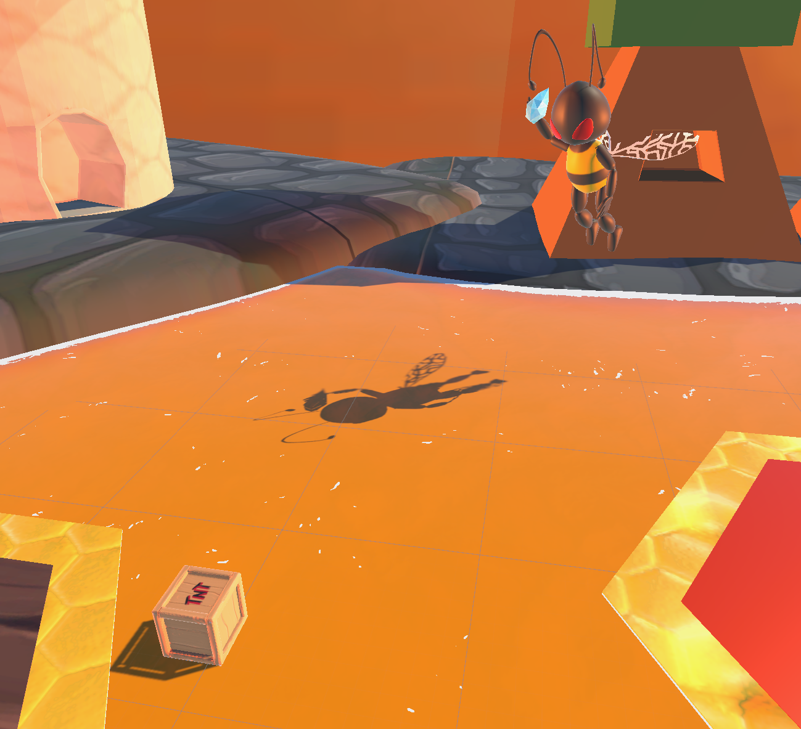

# Hive Havoc: Ants on Wheels

Created for Swinburne GAM20003 - Digital Game Prototyping Lab.

"Hive Havoc: Ants on Wheels" is a couch co-op 2-player game with asymmetrical roles, where 1 plays a third-person driver and the other a first-person rail-shooter. A high level of communication and coordination is vital to the gameplay, as both roles are intertwined inseparably and must depend on each other to achieve the shared goal. Fast-paced action, simple but chaotic mechanics, stylized art direction, an oversaturated colour palette and cheerful theme makes it the ideal party game for casual players.

With a dynamic split-screen camera reacting organically to on-screen events, "Hive Havoc: Ant on Wheels" sets itself apart from the rest.

## Features

### Hardware agnostic, affinity-driven input system

Building on top of Unity's new input system, this implementation allows specialized support for asymmetrical-role local co-op with affinity-driven input mapping.

Hardware is decoupled from any particular role, allowing the players freedom to pick their preferred controller.

In case of hardware failure, the system supports dynamic remap; simply reconnect a new device with the matching "type" (e.g. a Switch can substitute for an Xbox on account of both being "gamepads").

### Dynamic splitscreen

Depending on each player's role and current predicament, as the players progress through the level the perspective divider will dynamically adjust. This helps better indicate area of focus to improve playability and provides a more cinematic overall aesthetic, resulting in a more immersive play experience.

The current implementation supports split in 4 cardinal directions (left/right/top/bottom). Before switching orientation (horizontal <-> vertical), the shooter's viewport will be collapsed. Due to this constraint, the driver's viewport will always be anchored bottom/left in a split.

#### Altitude-Azimuth turret mount

A workaround solution to allow freedom of movement for a first-person shooter controls without IK animation rigging. Inspired by a telescope's Alt-Az mount, this mount is concerned with separating the Euler Yaw and Pitch rotation axis, each with individual constraints.

This makes it easier to handle conversion to and from Quaternion, allowing rotations to apply correctly in code, while still exposing designer-friendly boundary values in Euler degrees for rapid iterating.

#### Pickup ammo

To reload, the shooter needs to run over flowers, whose released pollen will be consumed to power the pollen turret.

#### Built-in timer

At the start of the level, a brief cutscene previews the level layout and introduces the end destination/time pressure, thematically a closing gate. This incentivizes both players to coordinate for a smooth run in order to achieve the shared goal.

## Dynamic environment

A destructible & organic environment gives the player immediate feedbacks to their actions. Almost every element in the world is interactable & responds to their influence.

### Fluid physics simulation

Each platform simulates buoyancy behaviour by defining "float points", empty colliders distributed to mesh vertices. A float point calculates the buoyancy force applied to the master rigidbody at that point proportionate to the object's weight, which is distributed evenly across all children float points. A more complex mesh shape can be made up of smaller floating components, each of which defines their own float points.

If they are caught in a blast radius, each floating component will react to the explosion by delegating it to the master rigidbody.

### Explosives & scripted events (trap)

Explosives come in 3 variations, each with varying blast radius and explosion force. One variation floats on honey.

Red tiles are trapped, and will activate when stepped on. A slow-motion sequence will play, where the shooter's viewport expand to make emphasis, and the shooter needs to take down the enemy unit before it can throw a projectile at the explosives, detonating it and destroying their path.

### Checkpoint system

Green tiles are checkpoint, and when stepped on will reset all registered dynamic objects in the directly following sequence.

Each dynamic object will register itself with a centralized manager at start, who will maintain a mapping to the currently active entity in scene. Objects who require a live reference to the current version of the respawnable can subscribe to its `OnRespawn` event, upon which it can update its reference correspondingly.

## Prerequisites

The project is built with Unity 2022.3.3f1. To run the project, an equal or higher version of Unity is recommended.

## Limitations & future plans

- Buoyancy physics doesn't scale well for larger volume mesh, due to simplifications of force-weight distribution.
- Buoyancy force calculation can be a good fit for the Job system.

## Built With

- [Unity 2022.3.3f1](https://unity.com/releases/editor/whats-new/2022.3.3) - The version of Unity used

## Contributors

- **Thien An Ly** - _Producer, lead programmer, technical artist, designer_ - [Aly](https://github.com/thelazyant164)
- **Hoang Phuc Huynh** - _Programmer, technical artist, designer_ - [Quearktum](https://github.com/Quearktum)
- **Lachlan Haines** - _3D artist_ - [Lachlan](https://linkedin.com/in/lachlan-haines-992899288/)
- **Meng Yu Lim** - _2D artist_ - [Powort](https://powort.carrd.co/)
- **Minh Hang Le** - _Environment artist_ - [Avie](mailto://minhhang.le2003@gmail.com)

### Acknowledgements

#### Icons

- **Flaticon** - _Vector Icons and Stickers_ - [Flaticon](https://www.flaticon.com/)

#### VFX

- **Gabriel Aguiar Prod** - _Projectile VFX_ - [Unique Projectiles Volume 1](https://assetstore.unity.com/packages/vfx/particles/unique-projectiles-volume-1-124214)
- **Effectcore** - _Explosion VFX_ - [Stylized Explosion Pack 1](https://assetstore.unity.com/packages/vfx/particles/stylized-explosion-pack-1-79037)
- **Dusker Studios** - _Dust VFX_ - [Simple Dust Particle System](https://forum.unity.com/threads/new-simple-dust-particle-system.341921/)

#### SFX

- **Gamemaster Audio** - _Gate SFX_ - [WARFARE SOUNDS](https://assetstore.unity.com/packages/audio/sound-fx/weapons/warfare-sounds-144323)
- **BushxMonkey98** - _Gun SFX_ - [Gun Reloading Sound Effect 2 [HD]](https://www.youtube.com/watch?v=WATu7yLTfNM&ab_channel=BushxMonkey98)
- **PK9 Sound Effect** - _Projectile SFX_ - [Bazooka M9a1 sang legenda](https://www.youtube.com/watch?v=QE107hahtwg&ab_channel=PK9SoundEffect)
- **SoundBites Central** - _Projectile SFX_ - [Bubble Pop / Sound Effects](https://www.youtube.com/watch?v=BLwlddU9j0s&ab_channel=SoundBitesCentral)
- **AudioKid** - _Projectile SFX_ - [Bubbles Popping Sound Effect](https://www.youtube.com/watch?v=1wIq0OaFa5A&ab_channel=AudioKid-SoundFXLibrary)
- **MrSoundtabel** - _Enemy SFX_ - [Thunder Sound effect](https://www.youtube.com/watch?v=T-BOPr7NXME&ab_channel=MrSoundtabel)
- **Sound Effects SoundCuration** - _Projectile SFX_ - [Magic Missile Sound Effect / Magic](https://www.youtube.com/watch?v=oJOEzSZOhX8&ab_channel=SoundEffectsSoundCuration)
- **AudioFX** - _Vehicle SFX_ - [Car Braking - Sound Effect [HQ]](https://www.youtube.com/watch?v=XBR8NuELc4w&ab_channel=AudioFX)
- **NMTVE** - _Checkpoint SFX_ - [Checkpoint Sound Effect](https://www.youtube.com/watch?v=DcxxHlKb3DI&ab_channel=NMTVE)

#### Voiceover

- **AngryUdder** - _Voiceover_ - [AngryUdder](https://www.twitch.tv/angryudder)

#### 3D Model & Material

- **Marbles Studio** - _Stylized plants_ - [Stylized Plant Pack](https://sketchfab.com/3d-models/stylized-plant-pack-d866603021fa4939b8e7bc28f22bb47c)
- **NinjaNinJosh** - _Honeycomb material_ - [Honeycomb Material](https://sketchfab.com/3d-models/honeycomb-material-7585e6e13cb04527a8ab56bd2ff56673)
- **iamsosha** - _Hexagon_ - [Hexagon](https://sketchfab.com/3d-models/hexagon-no-textures-75a0b9e8c51b4ad98d0a9a74735409b0)
- **MOJackal** - _Stylized gate_ - [Castle Portcullis](https://sketchfab.com/3d-models/castle-portcullis-33eaedccd4e54f4d979520ddef356a31)
- **Pasha4713** - _Barrel TNT_ - [TNT Barrel Low Poly](https://sketchfab.com/3d-models/tnt-barrel-low-poly-6765637140234447a6d94d5b2fa18da7)
- **FinnyInTheBinny** - _Floating TNT_ - [TNT Crate](https://sketchfab.com/3d-models/tnt-crate-4df5d147e65d4d5eb66338f37f46cce6)
- **Sannah Kavacup** - _Small TNT_ - [Caja TNT](https://sketchfab.com/3d-models/caja-tntinspired-from-crash-bandicoot-ec07efd2d715490891beb3d5bfae835e)
- **Jayanam** - _Import pipeline/workflow_ - [Blender Animation To Unity Tutorial](https://www.youtube.com/watch?v=uWexElqDcaA)

#### Liquid shader

- **BitGem** - _Liquid shader_ - [URP Stylized Water Shader - Proto Series](https://assetstore.unity.com/packages/vfx/shaders/urp-stylized-water-shader-proto-series-187485)

#### Buoyancy physics

- **Tom Weiland** - _Buoyancy physics_ - [Ship Buoyancy Tutorial](https://www.youtube.com/watch?v=eL_zHQEju8s&t=545s&ab_channel=TomWeiland)

#### Procedural road

- **Maxi Barmetler** - _Procedural road_ - [Road System](https://assetstore.unity.com/packages/tools/level-design/road-system-192818)

#### Arcade vehicle controller

- **Benmcinnes** - _Reference_ - [benmcinnes/ArcadeVehiclePhysics](https://github.com/benmcinnes/ArcadeVehiclePhysics)
- **Adrenal** - _Reference_ - [adrenak/tork](https://github.com/adrenak/tork)
- **SergeyMakeev** - _Reference_ - [SergeyMakeev/ArcadeCarPhysics](https://github.com/SergeyMakeev/ArcadeCarPhysics)
- **Unity-car-tutorials** - _Reference_ - [unity-car-tutorials/SimpleRaycastVehicle-Unity](https://github.com/unity-car-tutorials/SimpleRaycastVehicle-Unity)
- **Haim96** - _Reference_ - [haim96/SimpleRaycastVehicle-Unity](https://github.com/haim96/SimpleRaycastVehicle-Unity)
- **KenneyNL** - _Reference_ - [Tweet](https://twitter.com/KenneyNL/status/1107783904784715788?lang=en)
